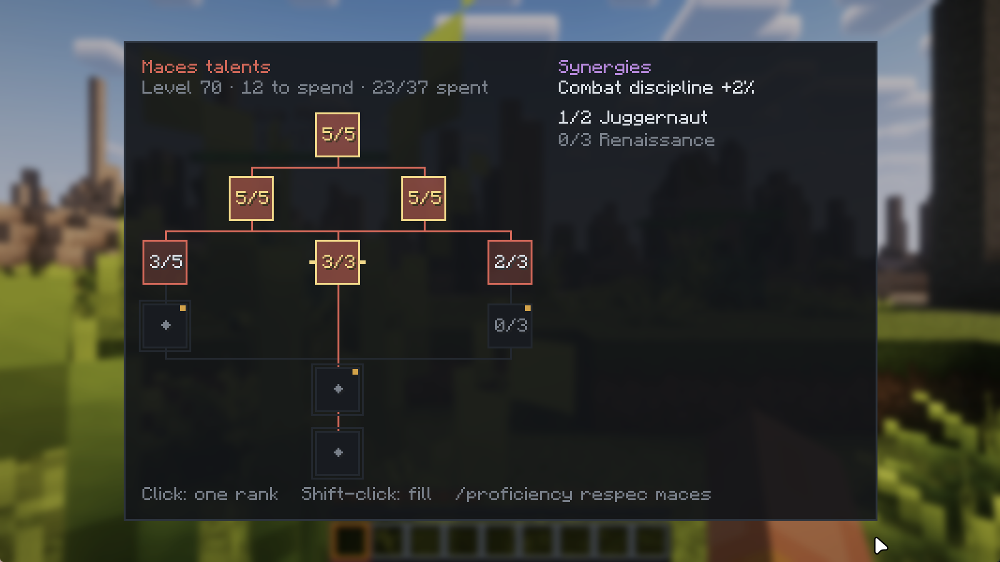

# Proficiency

A Valheim-style skill system for Minecraft. You get better at what you do. Mining raises Mining,
swinging an axe raises Axes, and sneaking past mobs raises Sneaking. There is no class to pick and no
character sheet to fill in.

This branch is the **NeoForge 1.21.1** build. The same mod exists for
[NeoForge 1.21.1](../../tree/main), [Fabric 1.21.1](../../tree/fabric-1.21.1) and
[Forge 1.20.1](../../tree/forge-1.20.1).



## What it adds

- **34 skills** in six categories, each from 0 to 100. Gathering, crafting, combat, movement,
  construction and survival.
- **A passive per skill** that grows with the level, and a **signature proc** from level 25: Mining
  hits a Motherlode, Woodcutting fells the whole tree, Swords land a Perfect Strike.
- **A talent tree per skill.** One point per level, and every tree can be filled completely by
  level 100. Branch choices set priority, never a lockout. A respec costs 1 XP level per 10 points.
- **17 synergies** between trees. Each pays off when you invest in two related skills.
- **An active ability per skill** from level 50. Tap the ability key for the held item's ability,
  hold it for a wheel with every ability you have unlocked.
- **Survival streak:** +1% skill XP per active hour alive, up to +50%. A death wipes the streak and
  the XP bars, never your levels or talents.
- **Discovery.** Banners for new biomes, dimensions and structures, a one-time bonus for every new
  kind of block, mob and item, and a discovery journal.
- **Items.** The Forester's Compass (finds unvisited biomes and structures), the Friend Compass, and
  station recipes made with a tool on a station (a ladle on a water cauldron, a smithing hammer on
  an anvil).
- **HUD.** The current skill's bar above the hotbar, XP dots that fly into it, and a small streak
  badge. Every tenth level is announced in chat.
- **Fair XP.** Blocks you placed pay no gathering XP when you break them. Mobs from spawn eggs,
  dispensers, commands and buckets pay no combat XP, and spawner mobs pay 25%. Unripe crops pay
  nothing.

Every tree, node and synergy is listed in [docs/TREES.md](docs/TREES.md). The full list of changes is
in [CHANGELOG.md](CHANGELOG.md).

## Install

Requires Minecraft **1.21.1** with **NeoForge 21.1.192 or newer**, Java 21.

Put `proficiency-1.0.0.jar` in the `mods/` folder of the **server and every client**. The mod registers items, so a
client without it cannot join a server that has it.

Default keys: **K** opens the skills panel, **G** uses an ability (hold it for the
wheel). Both can be rebound under Controls.

## Commands

| Command | Who |
|---|---|
| `/skills` | anyone, own levels |
| `/proficiency perks [skill]` | anyone, own trees |
| `/proficiency respec <skill>` | anyone, empties one tree for XP levels |
| `/proficiency synergies` | anyone, every synergy and your progress |
| `/proficiency recipes` | anyone, the station recipes |
| `/proficiency top <skill>` | anyone, best online player in that skill |
| `/skills xpfeed [on\|off]` | anyone, a live XP feed with every multiplier |
| `/proficiency set <player> <skill> <level>` | op |
| `/proficiency addxp <player> <skill> <amount>` | op |
| `/proficiency reset <player>` | op |

## Configuration

- `config/proficiency-server.toml`, created on first start: per-skill switches and XP rates, the
  level curve, the streak, abilities, and the placed-block and spawner rules
  (`placedBlocksPayXp`, `spawnerMobXp`, `artificialMobXp`).
- `config/proficiency-client.toml`, per player: banners, the XP feed position and the XP dots.

Levels cost `8 + 2 * L^1.35` XP by default, about 44,000 XP from 0 to 100. Change `curveFloor`,
`curveBase` and `curveExponent` in the server config to make it faster or slower.

## Works with

Nothing is a hard dependency. With these installed the mod picks them up: Create, Applied
Energistics 2 and storage mods (Engineering), Ars Nouveau (Spellcasting), Farmer's Delight
(Cooking), Twilight Forest, the Aether and boss mods (Beastslaying), furniture mods such as
Supplementaries and Chipped (Decorating), Falling Tree (Timber stands down) and Right Click Harvest.

## Build

```sh
./gradlew build
```

The jar is in `build/libs/`. `./gradlew test` runs the unit tests; `./gradlew runGameTestServer`
runs the in-world GameTests.

## License

MIT, see [LICENSE](LICENSE).
